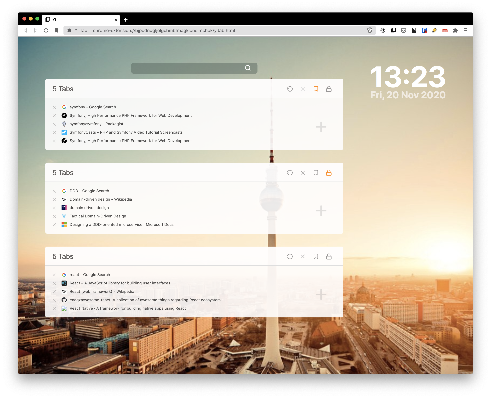
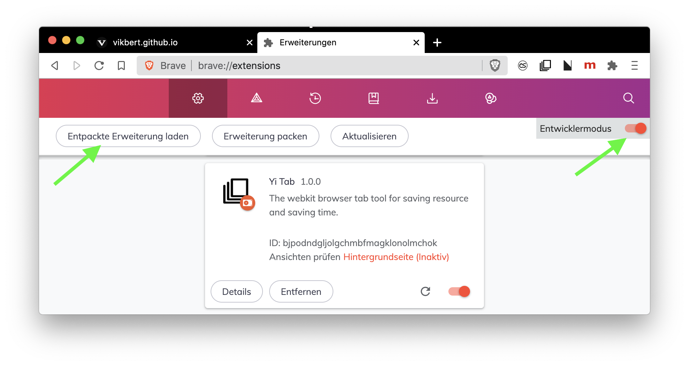

  <!-- Logo and title and sub-title -->
  
  <h1 style="font-weight: bolder; color: black; margin-top: 0px">
    YiTab
  </h1>
  <h3 style="color: darkgrey; margin: 40px 0"> 
    A chrome extension created with React + Typescript. 
  </h3>

  <!-- description of project -->
  

  <strong>YiTab</strong> allows you to free the chrome memory and save all open Tabs with just one click. You can restore all the URLs with one click, too. It can be very helpful, if you wanna clean up a couple of open Tabs, without losing all of them.

  I build it to do some experiment with <strong>React + TypeScript</strong>. Have a fun with it.

  <i>"Yi" means "One" in Chinese. This application is my react clone to the famous chrome plugin <a href="https://chrome.google.com/webstore/detail/onetab/chphlpgkkbolifaimnlloiipkdnihall?hl=en">"OneTab"</a></i>
  

  <!-- github icons for PR and License -->
  

    
    
  

---

## Getting started

1.  Complete the steps to build the project above
2.  Go to [_chrome://extensions_](chrome://extensions) in Google Chrome
3.  With the developer mode checkbox ticked, click **Load unpacked extension...** and select the `dist` folder to load the extension

## Building and Development

1.  Clone repository
2.  `npm i`
3.  `npm run dev` to compile once or `npm run watch` to run the dev task in watch mode
4.  `npm run build` to build a production (minified) version

