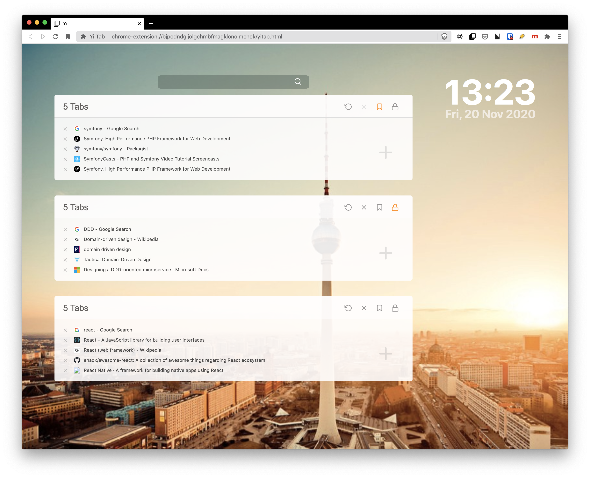

# YiTab Chrome Extension (built with TypeScript + React)

> This project is My React-TypeScript clone to famous extension [OneTab](https://chrome.google.com/webstore/detail/onetab/chphlpgkkbolifaimnlloiipkdnihall?hl=en)

`YiTab` allows you to free the chrome memory and save all open Tabs with just one click. You can restore all the URLs with one click, too. It can be very helpful, if you wanna clean up a couple of open Tabs, without losing all of them.

I build it to do some experiment with React + TypeScript. Have a fun with it.

## Building

1.  Clone repo
2.  `npm i`
3.  `npm run dev` to compile once or `npm run watch` to run the dev task in watch mode
4.  `npm run build` to build a production (minified) version

## Installation

1.  Complete the steps to build the project above
2.  Go to [_chrome://extensions_](chrome://extensions) in Google Chrome
3.  With the developer mode checkbox ticked, click **Load unpacked extension...** and select the _dist_ folder from this repo
